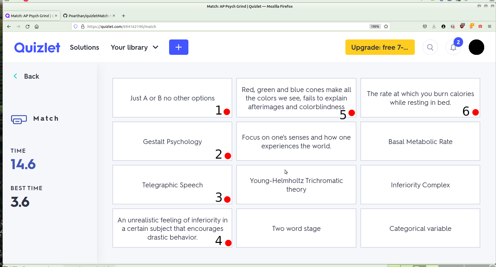
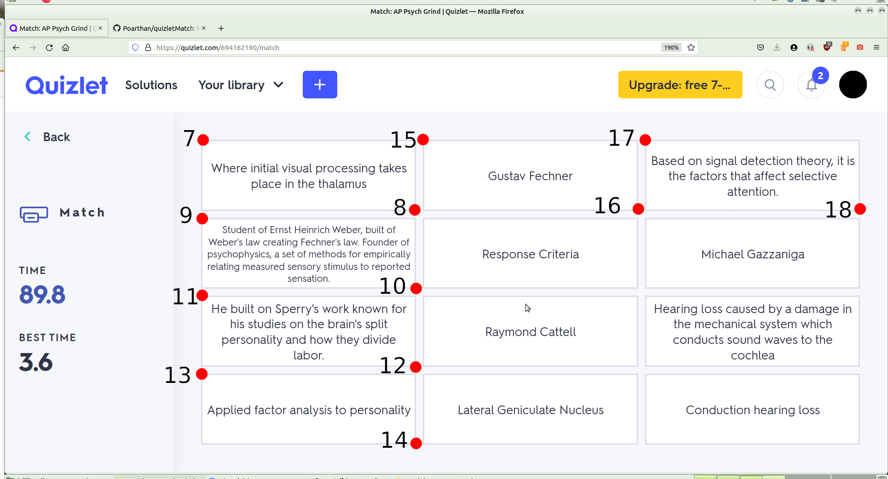
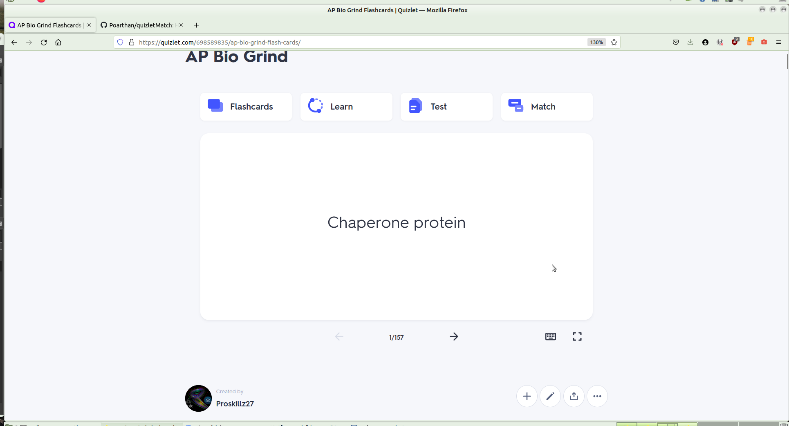
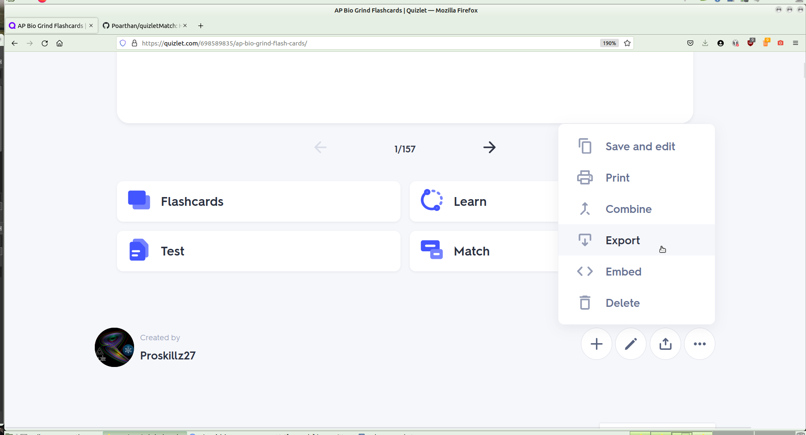
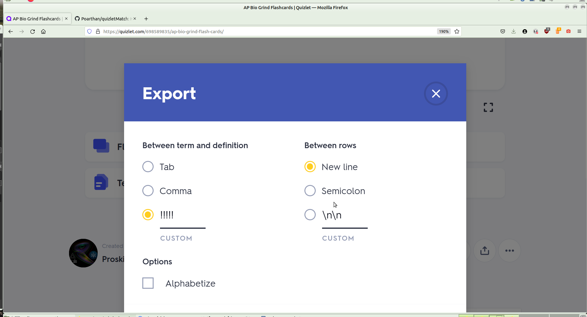

# Quizlet Matching AI
Have ever been studying and got bored, so played the quizlet match and thought you had a good time of 7 seconds and saw that first place had a whopping 5 seconds as you had studied the content pretty well and gotten infuriatingly angry to the point where a deep burning rage in your heart told you that the this world should end. Me neither, but if you would like to show those suckers who have a much faster reaction speed than you do the way its done, you can adapt this and crush those noobs.

This program uses machine learning text recognition to read text then compare with text similarity to the quilet list to check for matches. Then it matches everything together.

Want to test it, go to: https://quizlet.com/694162190/ap-psych-grind-flash-cards/

To set up:
This tutorial will be for Ubuntu Linux, for some of the installation setup, you will need to figure out yourself how to do it for other OS.
This uses python, so install python and install pip:
```
sudo apt update
sudo apt install python3
sudo apt install python3-pip
```
It also uses the questionable machine learning text reader pytesseract-OCR(https://github.com/tesseract-ocr/tesseract), but this is dream scenario, because it has white background, black text.
```
sudo apt-get install tesseract-ocr
pip install pytesseract
```
Other pip modules:
```
pip install -r requirements.txt
```
After quite a bit of testing so far the best way to do it fast is to use the pillow==8.4.0 library to take screenshot which is much faster than the pyscreenshot library, but it is possibly incompatable with other modules, which is sad.


To adapt this program to your computer screen. Open the quizlet test link and then click on match. Play around with the scales and match until you find a scale size that works with tile clicking instead of clicking and dragging and the text is still reasonably readable. As shown below:


The next step is to run get_coords.py with the following command and start configuring for your screen, press Y to reset coordfile and s when your ready to start recording coordinates:
```
python3 get_coords.py
```
Go through in order 1-6 and click on the red dots, then 7-18 click on the red dots, in the correct order:




Alt-tab to terminal and Ctrl-C to stop the program.

Now you can start a new quizlet match and run the program ``` python3 quizletmatchAI.py ``` and see how it does.

For other quizlets:
To set it up for other quizlets you need to get their list of words so you would go to their main page:


Click export:



Change divider to !!!!!(which is what is currently used by the code):


and copy paste it to the quizletmatchlist.txt
